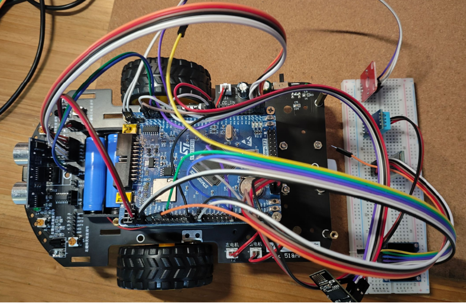
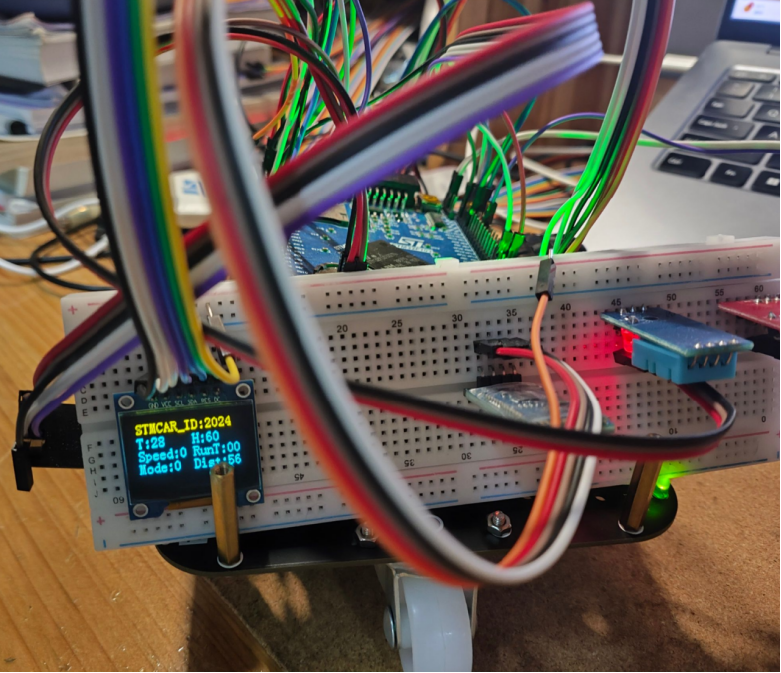
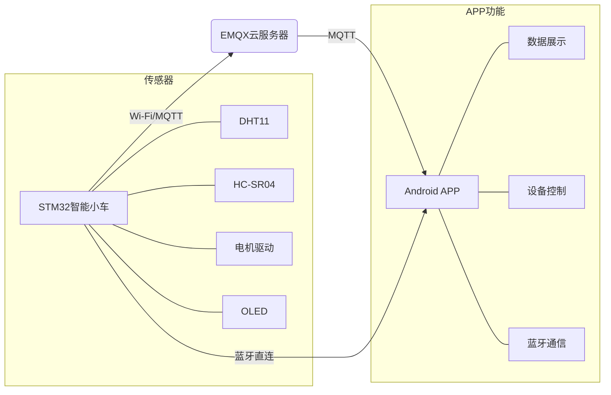
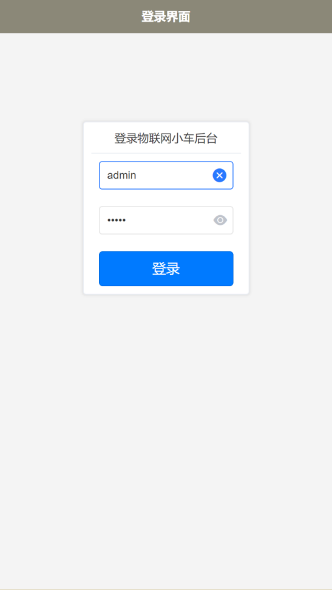
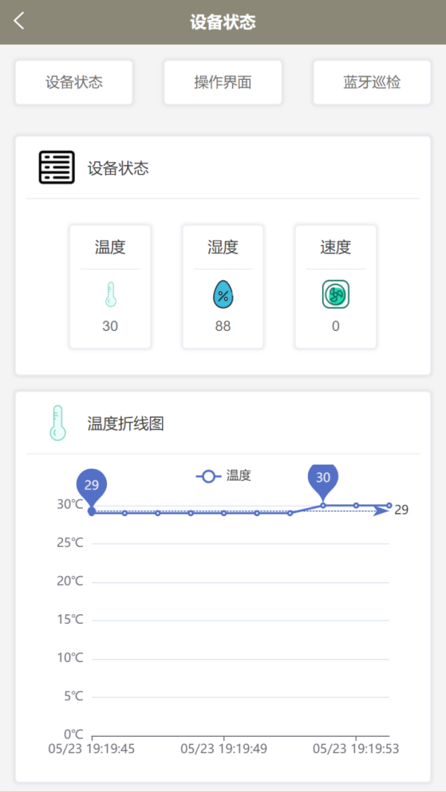
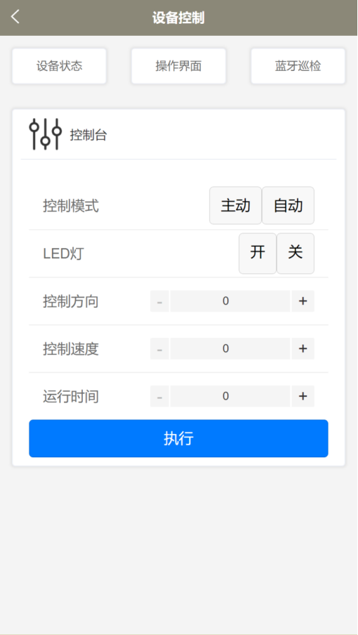
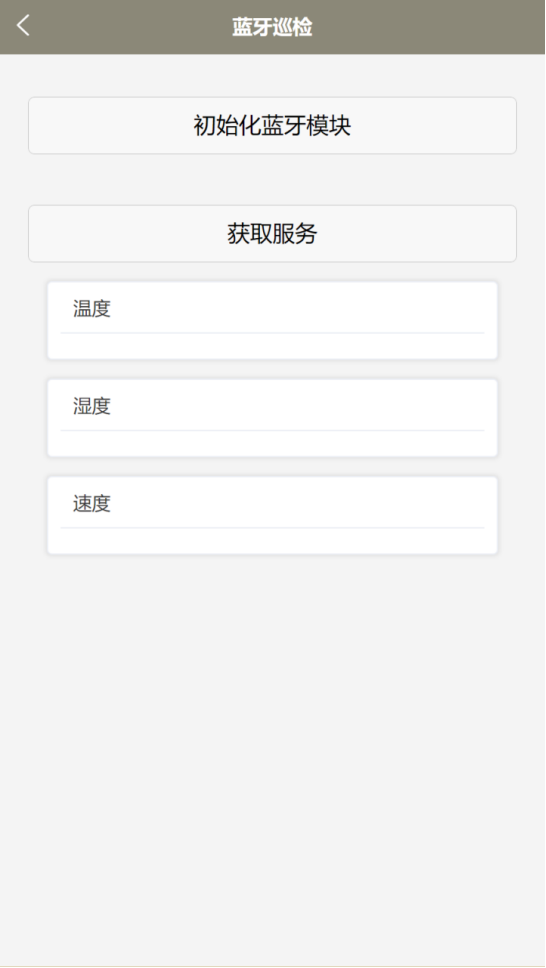

# 智能小车及其控制APP开发

[](LICENSE)
[]()

> 一款具备物联网特性的智能小车系统，通过云服务器实现远程监控与设备控制，同时支持蓝牙短距离通信。  
> 项目包含：**嵌入式硬件（STM32）** + **EMQX云服务器（MQTT）** + **Android控制APP（UniApp/Vue）**。

---

## 📱 项目简介

本项目设计并实现了一个“智能小车 + 云服务器 + 安卓APP”的完整物联网系统。  
- **智能小车**：基于STM32F103ZET6，集成温湿度传感器、超声波测距、电机驱动、OLED显示、Wi-Fi和蓝牙模块。  
- **云服务器**：部署EMQX MQTT服务器，负责设备与APP之间的消息转发。  
- **安卓APP**：使用UniApp（Vue）开发，提供数据展示、远程控制、蓝牙直连等功能。  

用户可通过APP实时查看环境温湿度、小车状态，并远程控制小车运动、LED灯开关等。同时支持蓝牙直连模式，满足低延迟短距离操控需求。

---

## 📸 实物展示



---

## 🎯 主要功能

### 硬件端（智能小车）
- **环境数据采集**：DHT11获取温湿度，HC-SR04测量障碍物距离。  
- **设备控制**：通过PWM调节电机转速/方向，控制LED灯。  
- **双模通信**：  
  - Wi-Fi（ESP8266-01S）连接EMQX服务器，实现远程数据传输。  
  - 蓝牙模块（BLE）支持APP直连，低延迟控制。  
- **本地显示**：0.96寸OLED实时显示温湿度、设备状态。  
- **自动/手动模式**：可切换自动避障或APP主动控制。

### APP端（Android）
- **用户登录**：简单账号认证，进入主界面。  
- **数据展示**：  
  - 温度、湿度、速度实时数值及趋势折线图。  
  - 设备状态图标（电机、LED等）。  
- **设备控制**：  
  - 控制模式切换（主动/自动）。  
  - LED开关、电机方向/速度/运行时间设定。  
- **蓝牙通信**：扫描、配对蓝牙模块，收发数据并展示。

### 服务器端
- **EMQX Cloud**：全托管MQTT服务，负责消息订阅/发布。  
- **数据流**：  
  - 小车定时发布温湿度/速度数据到主题。  
  - APP订阅相同主题，实时更新界面。  
  - APP发布控制指令到对应主题，小车执行。

---

## 🛠️ 技术栈

| 领域         | 技术                                                            |
|--------------|----------------------------------------------------------------|
| **嵌入式**   | STM32F103ZET6 (ARM Cortex-M3)、Keil5、HAL库、时间片轮询(任务调度) |
| **通信协议** | MQTT、TCP/IP、BLE（低功耗蓝牙）、USART                           |
| **云服务**   | EMQX (MQTT Broker)、阿里云ECS                                   |
| **移动端**   | UniApp (Vue.js)、HTML5、CSS3、JavaScript                        |
| **调试工具** | MQTTX、Xshell、sscom、ST-Link                                   |

---

## 🧩 系统架构



---

## 📦 硬件组成

| 模块            | 型号/规格                    | 作用                     |
|----------------|-----------------------------|--------------------------|
| 主控芯片        | STM32F103ZET6               | 核心控制与数据处理       |
| 电机驱动        | TB6612FNG                   | 直流电机PWM调速          |
| 温湿度传感器    | DHT11                       | 采集温度、湿度           |
| 超声波模块      | HC-SR04                     | 障碍物测距               |
| Wi-Fi模块       | ESP8266-01S                 | 连接云服务器（MQTT）     |
| 蓝牙模块        | BLE（支持UART）             | 短距离直连APP            |
| 显示模块        | 0.96寸 OLED (SSD1306)       | 本地数据显示             |
| 其他            | LED、按键、杜邦线、面包板等 | 状态指示与交互           |

---

## 📱 APP界面预览

> *以下为APP主要界面截图*

| 登录界面 | 数据展示 | 设备控制 | 蓝牙通信 |
|:---:|:---:|:---:|:---:|
|  |  |  |  |

---

## 🚀 快速开始

### 1. 硬件接线
按照毕业设计说明书第4章中的接线表连接各模块。  
**主要引脚映射（示例）**：
- `ESP8266`：USART2 (PA2/TX, PA3/RX)
- `蓝牙模块`：USART1 (PA9/TX, PA10/RX)
- `DHT11`：PG11
- `OLED (I2C)`：SCL-PG12, SDA-PD5
- `电机驱动(TB6612FNG)`：PE0~PE5

### 2. 服务器配置
- 注册并创建EMQX Cloud部署，获取连接地址、端口、用户名/密码。  
- 在 `aliyun_connect.h` 中配置Wi-Fi的SSID、密码以及MQTT broker信息。

### 3. 编译烧录
- 使用Keil5打开工程，编译并下载到STM32开发板（通过ST-Link）。  
- 确保各模块初始化成功（OLED显示启动信息）。

### 4. 运行APP
- 使用HBuilderX导入 `APP` 目录，编译并安装到Android手机（要求Android 4.4+）。  
- 登录（测试账号：任意非空，仅演示用）。  
- 确保手机与小车处于同一局域网（Wi-Fi模式），或开启蓝牙连接。

### 5. 操作验证
- 观察APP数据界面是否显示温湿度、速度等。  
- 点击控制按钮（如“前进”、“LED开”），检查小车响应。  
- 尝试蓝牙模式：点击“初始化蓝牙”-> 扫描设备 -> 连接小车蓝牙 -> 收发数据。

---

## 🧪 测试结果

| 测试项                         | 预期结果                                 | 实际结果 |
|--------------------------------|------------------------------------------|----------|
| 小车 → APP 数据传输（Wi-Fi）   | APP实时显示温湿度、速度，与小车OLED一致  | ✅ 通过  |
| APP → 小车控制指令（Wi-Fi）    | 小车执行转向、调速、LED开关等指令        | ✅ 通过  |
| 蓝牙双向通信                   | APP可接收传感器数据并可发送控制指令       | ✅ 通过  |
| 服务器连接稳定性               | 长时间运行不掉线，数据延迟<500ms         | ✅ 通过  |
| OLED本地显示                   | 显示温湿度、模式等信息                   | ✅ 通过  |

**结论**：系统功能完整，性能稳定，满足物联网智能小车设计要求。

---

## 📁 项目结构

```text
smart-car-project/
├── stm32_code/                # 嵌入式源码（Keil工程）
│   ├── Core/                  # 主程序、中断处理、任务调度入口
│   ├── Drivers/               # 各模块驱动（DHT11, OLED, Motor...）
│   ├── Net/                   # MQTT连接、Wi-Fi配网、数据封装
│   └── Sys/                   # 系统配置、时钟、低功耗预留接口
├── app_code/                     # UniApp安卓源码
│   ├── pages/                    # 登录、数据展示、控制、蓝牙页面
│   ├── utils/                    # MQTT工具、蓝牙API封装
│   └── store/                    # Vuex状态管理（温度、湿度、速度）
├── images/                         # 小车图和APP界面图
└── README.md                     # 本文件
```

---

## 🔮 未来改进方向

- **增加视觉功能**：接入摄像头模块，实现图像识别或远程图传。  
- **自主导航**：结合多传感器融合算法，实现SLAM和路径规划。  
- **语音控制**：集成语音识别模块，允许APP语音指令操控。  
- **数据持久化**：将历史温湿度数据存储到云端数据库，生成报表。  
- **多车协同**：通过同一个MQTT broker实现多小车群控。


---

⭐ 如果这个项目对你有帮助，欢迎点个Star！  
